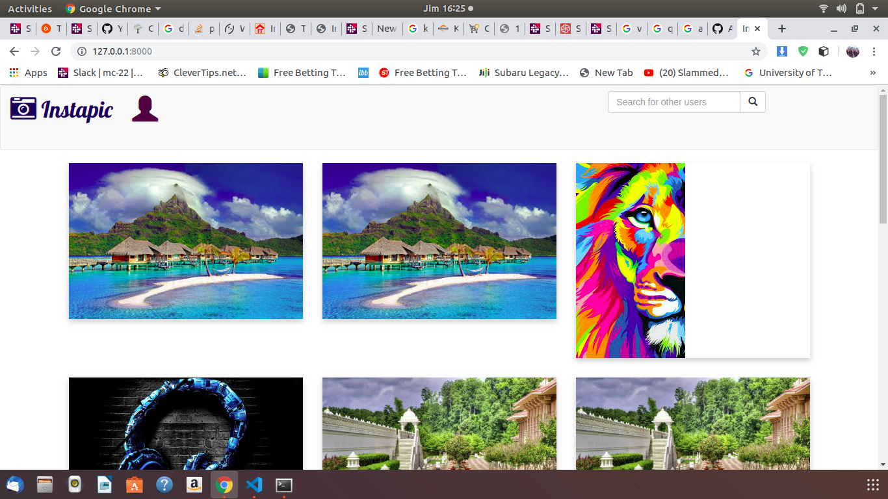

## Instagram
An application build using Django a python framework.This applikcation allows one to signup, sign in in the application to like,comment and and view the images posted bythe user.

## Author name
AUDREY MITCHEL MACHARIA

## Project Description
Instaphoto  is an app build with python3.6,its an app that allows you to login into an account upload images in your
account follow other users on instapics  like their photos and also one can comment on their photos

## Application setup instructions:
- INstall Django3.2 and python3.6

- Git clone repo then you will need to install venv that is a  virtual enviroment and run source virtual/bin/activate

- Then pip freeze > requirements.txt